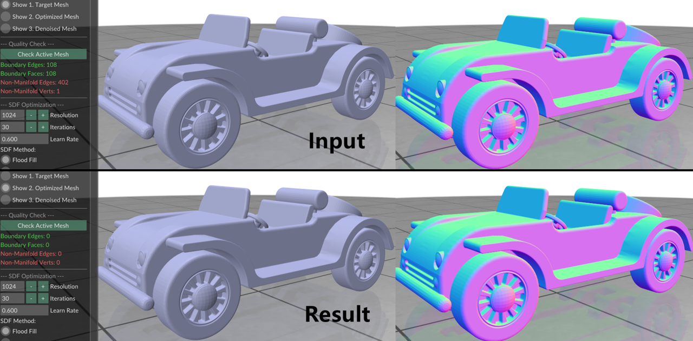

# SparseWatertight

SparseWatertight 是一个用于网格水密化（Watertight Reconstruction）的几何处理工具。

---

## 1. 简介
<p align="center">
  
  <br>
  <em>项目集成了 Polyscope 可视化界面：展示了从原始输入到水密化的效果(未启用网格去噪)。</em>
</p>

该软件主要用于修复三维模型中常见的几何与拓扑问题，包括：

- Open boundary（开放边界 / 孔洞）
- 非流形结构（Non-manifold geometry）

目标是在保证模型水密性的前提下，尽可能保持原始输入模型的形状特征。

---

## 2. 算法简介

本项目的核心方法基于论文：

**Sparc3D**  
https://arxiv.org/pdf/2505.14521

整体流程如下：

1. 构建 sparse grid（稀疏体素网格）
2. 使用 flood fill 界定内外占据关系，并计算二值化的SDF
3. 在固定拓扑结构下优化 sparse grid 的角点位置: 从优化后的体素结构中提取 isosurface，使其贴近原始输入模型
4. 在优化过程中加入拉普拉斯正则项以增强稳定性

### 可选后处理

支持可选的去噪步骤，基于论文：

**Bilateral Normal Filtering for Mesh Denoising**  
https://ieeexplore.ieee.org/document/5674028

该方法通过法线双边滤波对网格进行平滑，在降低噪声的同时强化几何特征。

---

## 3. 配置与依赖

### 开发环境

- Visual Studio
- CMake
- vcpkg

### 第三方库

通过 vcpkg 集成以下库：

- libigl
- Eigen
- CGAL

可视化由 Polyscope 提供（以 submodule 形式引入）。

### CMake 配置

在构建前，请修改 `CMakePresets.json` 中的工具链路径：
'''
"CMAKE_TOOLCHAIN_FILE": "yours/vcpkg/scripts/buildsystems/vcpkg.cmake"
'''

---

## 4. 数据和可执行文件

仓库中包含一个示例模型：

```
assets/car.ply
```

exe文件夹下是可执行文件


